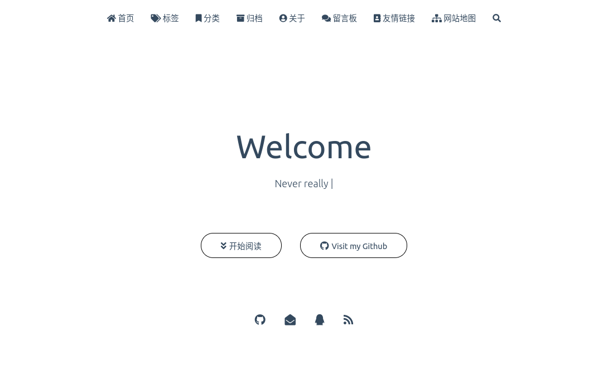

# hexo-matery-ink

一份极简风格的 hexo 主题， fork 自 [hexo-theme-matery v2.0.0](https://github.com/blinkfox/hexo-theme-matery)。

主要是删除了首页的轮播图和文章卡片上的图片,对小带宽服务器更加友好，并且修改了大量 css 实现一个亮色主题。

在线演示:[https://blog.m1dsummer.top](https://blog.m1dsummer.top)

配置文件 `_config.yml` 参考[源仓库]()的配置方式。